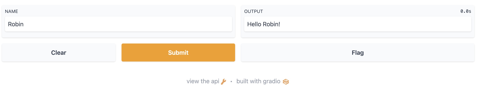

# gradio-docker-demo

```
docker build -t gradio-demo .

docker run -d -p 81:7860 gradio-demo --root_path="/gradio"
```

Go to [http://localhost:7860/](http://localhost:7860/)

<p align="center">

</p>
